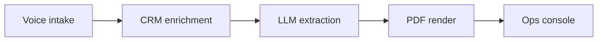
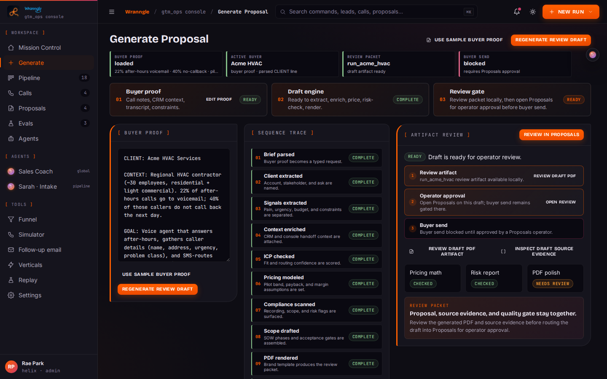
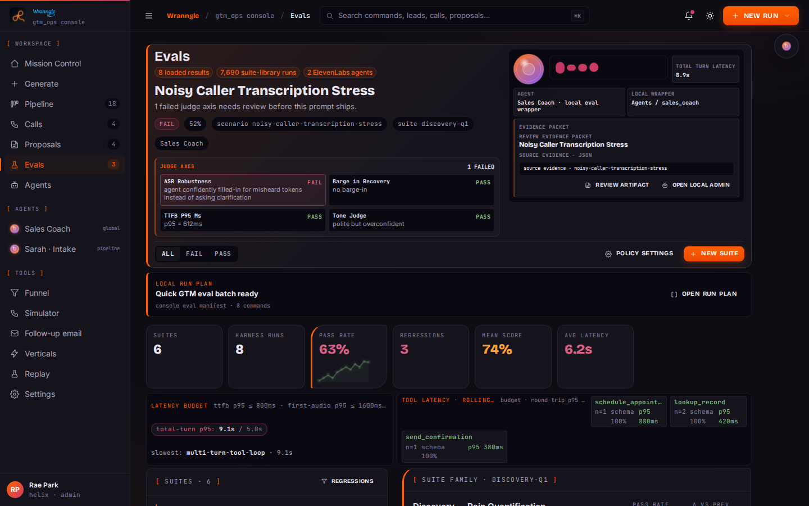
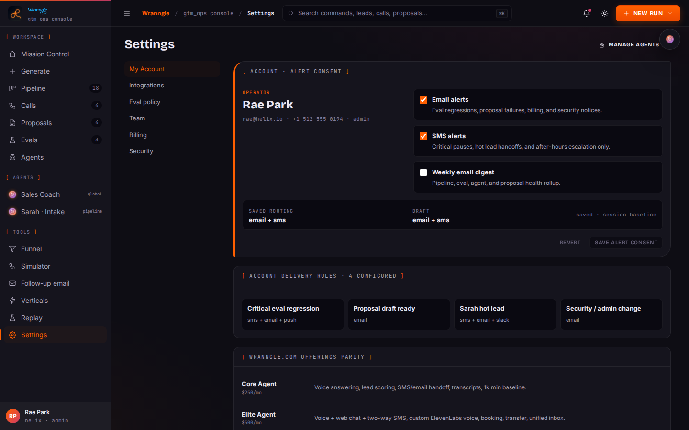

<div align="center">
<picture>
  <source media="(prefers-color-scheme: dark)" srcset="docs/brand/gtm_ops-wordmark-dark.png">
  <source media="(prefers-color-scheme: light)" srcset="docs/brand/gtm_ops-wordmark-light.png">
  
</picture>

#### voice intake · CRM enrichment · LLM extraction · branded PDF · audit trail · ops console

# Turn an inbound call into a branded PDF proposal

**[Demo](#-try-it-in-60-seconds) | [Features](#-features) | [Getting started](#-getting-started) | [Architecture](#-architecture) | [Deploy](#-deploy)**

### [🧭 Open the live console → app.wranngle.com/console](https://app.wranngle.com/console/)

**[One click replays the full 11-step pipeline →](https://gtm-ops.pages.dev/console/?route=generate&demo=1)** synthetic fixtures, no backend, no signup, about 60 seconds.

**❤️ [Sponsor this project](https://github.com/sponsors/wranngle) ❤️**

[](https://github.com/wranngle/gtm_ops/actions/workflows/ci.yml)
[](LICENSE)
[](https://github.com/wranngle/gtm_ops/commits/main)
[](https://github.com/wranngle/gtm_ops/graphs/contributors)

[](https://github.com/wranngle/gtm_ops/stargazers)
[](https://github.com/wranngle)
</div>

---


Voice-agent GTM runtime that turns an inbound call into a branded PDF proposal ready for operator review. The voice agent enriches the lead from CRM context, structured LLM extraction generates the proposal, every step writes audit logs, and operators review the result in the ops-console. One repo, one runnable thing, end-to-end against synthetic fixtures (`DEMO_MODE`) or a live backend.



## 🧭 Features

- 🧭 **Voice intake**: an ElevenLabs agent takes the call; the post-call webhook only processes payloads that pass HMAC-SHA256 signature verification.
- 🧭 **CRM enrichment**: Pipedrive, HubSpot, and Salesforce-shaped adapters pull lead context into the draft before extraction runs.
- 🧭 **Structured LLM extraction**: the transcript becomes typed proposal fields through an 11-step pipeline covering intake, extraction, enrichment, pricing, compliance, scope, PDF render, and audit.
- 🧭 **Branded PDF**: PyMuPDF renders each proposal from branded HTML templates driven by the token system.
- 🧭 **Audit trail**: every pipeline step writes an audit log the console surfaces.
- 🧭 **Ops console**: React with no build step; the same UI runs static against bundled fixtures (`DEMO_MODE`) or a live backend, with the Agents route and the Evals regression lab mounting live ElevenLabs ConvAI playgrounds.
- 🧭 **Presales CLI**: the same pipeline runs headless from the command line.

## ⚡ Try it in 60 seconds

**[Launch the canned proposal trace →](https://gtm-ops.pages.dev/console/?route=generate&demo=1)**

Click once. The Generate page auto-loads the HVAC sample brief and replays the 11-step pipeline (intake → extract → enrichment → pricing → compliance → scope → PDF render → audit). No backend, no signup, no operator interaction. Lands on a ready-to-review proposal in about 60 seconds.

[`app.wranngle.com`](https://app.wranngle.com) is the canonical host; `gtm-ops.pages.dev` is the preview host, where `DEMO_MODE` activates. In `DEMO_MODE` the page intercepts `/api/*` and serves bundled fixtures, so the whole console stays interactive without a live backend. `/console/?route=evals` opens the native eval dashboard and `/eval-runs/` serves the harness output.

|  |  |  |
| :---: | :---: | :---: |

*Generate, Evals, and Settings routes.*

## 🔌 One vendor per leg

<table>
<tr>
<td align="center" width="20%"><b>Voice</b><br/>ElevenLabs conversational agent</td>
<td align="center" width="20%"><b>CRM</b><br/>Pipedrive, HubSpot, Salesforce-shaped adapters</td>
<td align="center" width="20%"><b>Extraction</b><br/>structured LLM output</td>
<td align="center" width="20%"><b>PDF</b><br/>PyMuPDF render</td>
<td align="center" width="20%"><b>Review</b><br/>ops console over audit logs</td>
</tr>
</table>

CRM adapter shapes name these systems; they are shapes, not certified integrations.

## 🚀 Getting started

**Live mode** (full Express backend):

1. Install dependencies, including PyMuPDF for PDF rendering:

   ```bash
   bun install
   python3 -m venv .venv
   .venv/bin/python -m pip install --require-hashes -r requirements.txt
   ```

2. Start the server:

   ```bash
   bun run start   # Express on :3000
   ```

**Static / DEMO_MODE** (no backend, fixture-driven):

```bash
cd apps/ops-console
python3 -m http.server 4173   # then open http://localhost:4173/console/
```

Every `/api/*` call falls through to bundled JSON fixtures; the same UI runs in both modes. The ElevenLabs Sales Coach and Sarah Intake widgets mount live when the ConvAI embed script is reachable, and fall back to a deep link on `elevenlabs.io` otherwise. Append `?admin=1` to the console URL to reveal admin-only agents.

## 🧪 Tests

```bash
bun run typecheck         # tsc, no emit
bun run test:run          # 2901 vitest unit tests
bun run test:console      # 451 Playwright console UI tests
bun run test:e2e          # 327 Playwright PDF and report tests
bun run eval:harness      # run this repo through voice_ai_agent_evals
```

## 📐 Architecture

[`ARCHITECTURE.md`](ARCHITECTURE.md) covers the product layers (intake → enrichment → voice → post-call → presales → ops-console) and the two satellites:

- [`wranngle/voice_ai_agent_evals`](https://github.com/wranngle/voice_ai_agent_evals): eval harness wired to the live ElevenLabs agent
- [`wranngle/n8n`](https://github.com/wranngle/n8n): the sanitized n8n workflow library, single source of truth for workflows

[`eval-harness.manifest.json`](eval-harness.manifest.json) encodes the app-to-harness boundary: this repo owns fixtures and test semantics, the harness consumes the manifest and normalizes results.

## 🎨 Brand system

[`DESIGN.md`](DESIGN.md) is the canonical brand spec. [`tokens/`](tokens/) carries the machine-readable extracts (`tokens.css`, `tokens.json`, `tokens.tailwind.js`); vendor those into consumer repos rather than copying the long-form spec.

## 🚢 Deploy

`apps/ops-console/` deploys to Cloudflare Pages. Pages Functions under `functions/api/` serve a subset of `/api/*` (D1-backed where bindings exist, fixture fallback otherwise); `/api/generate` stays Express-only on a separate host.

```bash
bun run deploy            # production
bun run deploy:preview    # preview branch
bun run pages:dev         # local CF Pages emulator
```

Config lives in [`wrangler.toml`](wrangler.toml), with security and cache headers in [`apps/ops-console/_headers`](apps/ops-console/_headers) and fixture fallbacks in [`apps/ops-console/_redirects`](apps/ops-console/_redirects).

## ⭐ Star history

<!--
Restore this line when api.star-history.com recovers from its outage:
[](https://www.star-history.com/#wranngle/gtm_ops&Date)
-->

[](https://www.star-history.com/#wranngle/gtm_ops&Date)

[**View the interactive star history**](https://www.star-history.com/#wranngle/gtm_ops&Date), drawn live even while star-history's image API is down.

## License

MIT. See [LICENSE](LICENSE).
